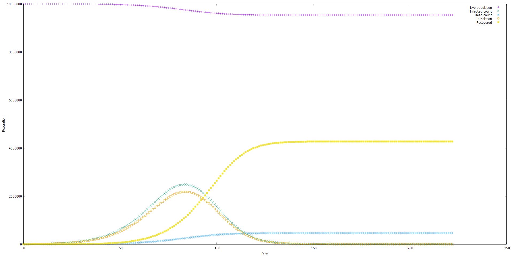

# A Tiny Epidemiological Simulator in Go

This simulator simulates interactions between hundreds of millions of people the "brute force" numerical way: there's literally state being kept for each and every simulated person. There are probably equations which do this much more efficiently without simulating each individual person. This simulator simulates what's going on with the population day-by-day.

The result is a CSV file outputted to stdout. CSV data can be graphed, e.g. with gnuplot:




The upper limit on the number of simulated people here is 4 billion. This simulator is designed to save memory at all times, so simulating even 4 billion people should be possible on a 16 GiB system. It probably doesn't make any sense, i.e. there's nothing new to learn from the experiment, to simulate more than a couple of million people.

There are dozens, if not hundreds of factors and assumptions which can go into making a usable epidemiological simultor. But that's the entire catch and a multi-trillion dollar question: how do we choose which factors and assumptions to include, and which have an impact which is small enough to be negligible? Here are the assumptions and parameters which this simulator is built on:

* There's a finite, static population in the simulator (`population_count`)
* Every person has the same likelyhood of being infected and consequently dieing as others (this is probably the first thing I'd change if I work on it further)
* There's an initial number of infected people in the pool (`start_infected`)
* Each person interacts with a certain number of people daily (`interaction_circle_count`), and this set of people is different for each person, but doesn't ever change
* In each of those interactions, an infected person has a chance to infect an uninfected person who isn't immune
* People get immunity after recovering from the disease (after `total_disease_days` days)
* When infected, each person has a probability of going into isolation / quarantine (`isolation_ratio` - think of it as the ratio of discovered infected people, as some are asymptomatic)
* Certain ratio of people are always isolation violators (`isolation_violators_ratio`)
* Certain ratio of people are always asymptomatic (`asymptomatic_ratio`)
* Others are asymptomatic for a certain number of days (`asymptomatic_days`)
* In each interaction between an infected person and an uninfected person, the chance of infection is different based on two parameters: is the infected person asymptomatic, and is the infected person in isolation. This plays out as four different probabilities (`spread_prob_isolation`, `spread_prob_not_isolation`, `spread_prob_asymptomatic_isolation`, `spread_prob_asymptomatic_not_isolation`). Only if the isolation is total should the respective parameters be set to 0.
* The chance of each infected person dieing depends on if the healthcare system collapsed or not, i.e. there are two probabilities (`death_prob_normal`, `death_prob_collapsed`)
* There's a threshold in the number of infected people (`collapse_threshold`) which governs is the healthcare system in collapse or not.

The default parameters, at least at the time of this writing, are:

```
{
  "algorithm_type": 1,
  "population_count":                10000000,
  "start_infected":                      1000,
  "collapse_threshold":                  5000,
  "interaction_circle_count":              40,
  "asymptomatic_ratio":                     0.5,
  "isolation_ratio":                        0.9,
  "isolation_violators_ratio":              0.1,
  "asymptomatic_days":                     13,
  "total_disease_days":                    25,
  "spread_prob_isolation":                  0.001,
  "spread_prob_not_isolation":              0.4,
  "spread_prob_asymptomatic_isolation":     0.0001,
  "spread_prob_asymptomatic_not_isolation": 0.001,
  "death_prob_normal":                      0.0008,
  "death_prob_collapse":                    0.006
}
```

Again, there's a large number of parameters which COULD be simulated, for example if the person is in ICU or not (which would govern the person's infectivity, mortality and its impact on the healthcare system). Another thing to improve would be to have an interval distribution for the number of days people are asympromatic and ill. Forks and patches are welcome ;)

See the [example_result.csv](example_result.csv) file for an example run. This data was used to create a chart from the top of this page.

## FAQ

* Yes, the simulator gets increasingly slower as the number of infected people grows - it does simulate their actions after all.
* Yes, it's sensitive to starting conditions and choices in implementation, but not as much as expected. There's a parameter called `algorithm_type` which can be 0, 1 or 2, which siwtches between progressively faster algorithms. The only thing it changes in the simulation is the choice of which fixed set of people a person interacts with - and the results can be different, but they tend to converge to similar trajectories.

## How to use it

1. Install Go
2. `git clone https://github.com/ivoras/epidem.git`
3. `cd epidem`
4. `go build`
5. `./epidem`

There are a couple of optional command-line arguments:

* `-p` : Prints out the default simulation parameters in JSON format and exits
* `-l <filename>` : Loads simulation parameters from a JSON file and exits
* `-s <number>` : Sets the pseudo-random number seed, for repeatability (it's 42 by default)

# IMPORTANT DISCLAIMER

The author of this tool is NOT AN EPIDEMIOLOGIST, NOT EVEN A MEDICAL DOCTOR! Do not draw conclusions based on the results of this tool.